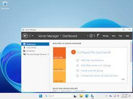

# Secure File Sharing Server

This project demonstrates setting up a secure file sharing server to allow controlled access to files over a network.

## Overview

- Configure shared folders with proper permissions  
- Use SMB or FTP protocols for file sharing  
- Implement user authentication and access controls  
- Ensure data security and encryption during transfer

## Why It Matters

File sharing is critical in IT support for collaboration and resource sharing while maintaining security and privacy.

## Screenshot

